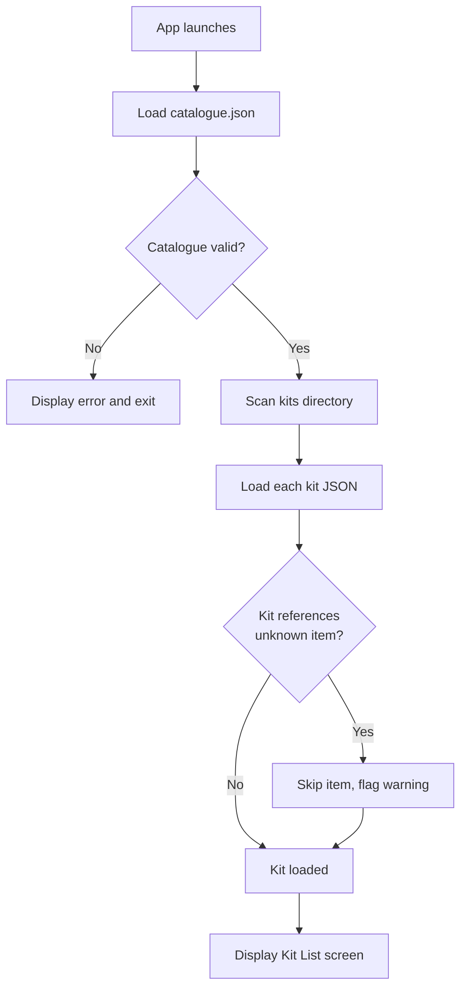
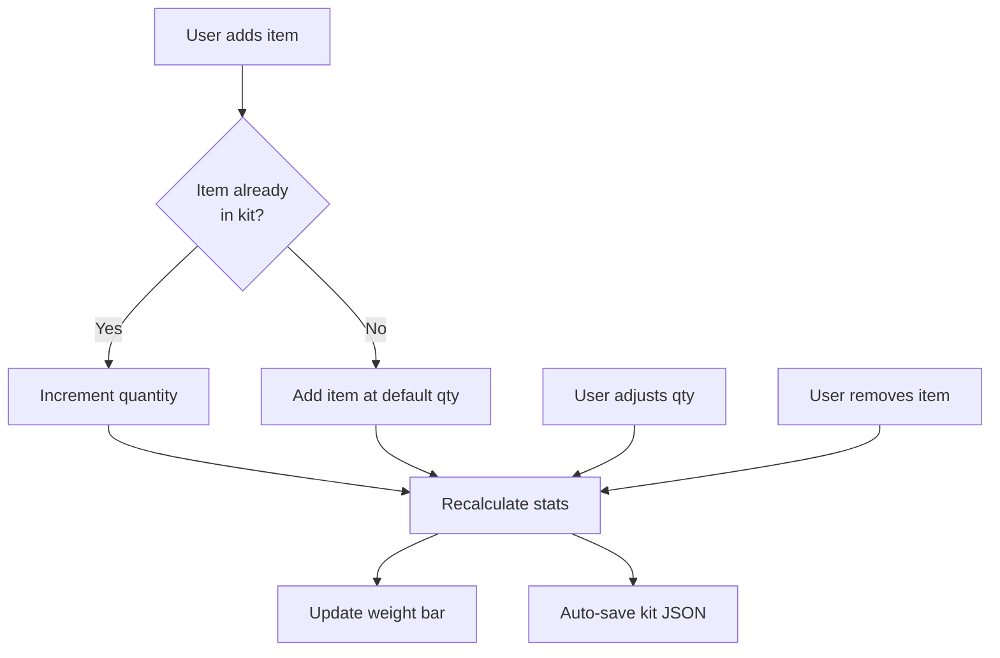
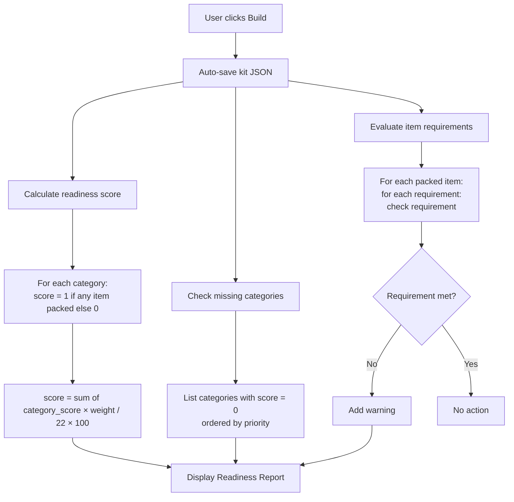
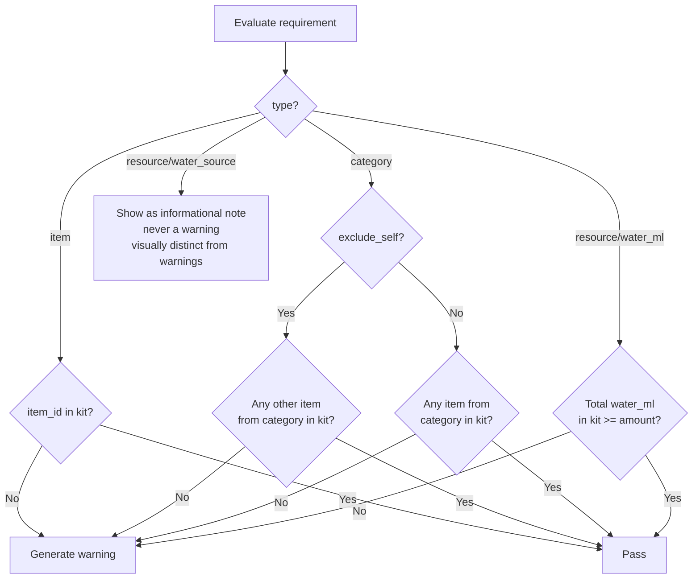
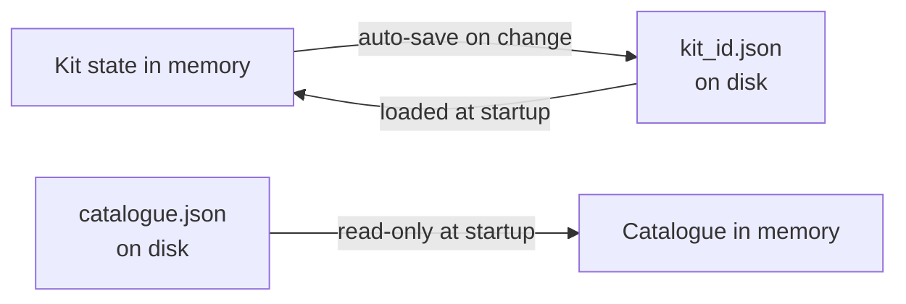

# KitForge — Data Flow

**Version:** 0.1  
**Date:** 2026-05-03

---

## App Startup

---

## Kit Building

---

## Readiness Report

---

## Requirement Evaluation Detail

---

## Persistence

