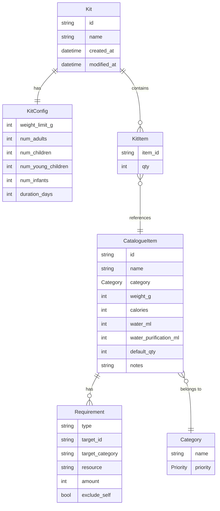

# KitForge — Data Model

**Version:** 0.1  
**Date:** 2026-05-03

---

## Entity Relationship Diagram

---

## Field Reference

### Kit

| Field | Type | Notes |
|---|---|---|
| `id` | string | UUID v4; used as filename |
| `name` | string | User-editable; defaults to "New Kit" |
| `created_at` | datetime | ISO 8601; set on creation |
| `modified_at` | datetime | ISO 8601; updated on any change |

### KitConfig

Stored as a nested object inside Kit.

| Field | Type | Notes |
|---|---|---|
| `weight_limit_g` | int | Maximum carry weight in grams |
| `num_adults` | int | Number of adults (13+ years); ~2000 kcal/day, ~3L water/day |
| `num_children` | int | Number of children (6-12 years); ~1500 kcal/day, ~2L water/day |
| `num_young_children` | int | Number of young children (2-5 years); ~1200 kcal/day, ~1.5L water/day |
| `num_infants` | int | Number of infants (0-1 years); ~700 kcal/day, ~1L water/day |
| `duration_days` | int | Number of days the kit must cover |

### KitItem

Each entry in the kit's `items` array.

| Field | Type | Notes |
|---|---|---|
| `item_id` | string | References `CatalogueItem.id`; must never change |
| `qty` | int | User-set quantity; minimum 1 |

### CatalogueItem

| Field | Type | Notes |
|---|---|---|
| `id` | string | Stable unique slug; must never change |
| `name` | string | Display name |
| `category` | Category | Enum value, e.g. `Category.WATER` |
| `weight_g` | int | Weight per unit in grams |
| `calories` | int | Calories per unit; 0 if not food |
| `water_ml` | int | Stored water provided per unit; 0 if none |
| `water_purification_ml` | int | Water purifiable per unit if a source is available; 0 if not applicable |
| `default_qty` | int | Quantity applied when item is first added to a kit |
| `notes` | string | Optional short description |
| `requires` | Requirement[] | Dependency requirements; empty list if none |

### Requirement

Each entry in a `CatalogueItem`'s `requires` array. Fields used depend on `type`.

| Field | Type | Used when |
|---|---|---|
| `type` | RequirementType | Always — `"item"`, `"category"`, or `"resource"` |
| `target_id` | string | `type = "item"` |
| `target_category` | string | `type = "category"` |
| `exclude_self` | bool | `type = "category"` — if true, the item itself does not satisfy its own category requirement; defaults to false |
| `resource` | ResourceType | `type = "resource"` — `"water_source"` or `"water_ml"` |
| `amount` | int | `type = "resource"`, `resource = "water_ml"` — minimum ml of stored water required |

### Category

| Name | Priority |
|---|---|
| Water | Required |
| Food | Required |
| Medical | Required |
| Light | Required |
| Fire | Warning |
| Shelter | Warning |
| Tools | Warning |
| Navigation | Optional |
| Hygiene | Optional |
| Communication | Optional |
| Documents | Optional |

**Priority weights** (used in readiness score):

| Priority | Weight |
|---|---|
| Required | 3 |
| Warning | 2 |
| Optional | 1 |
